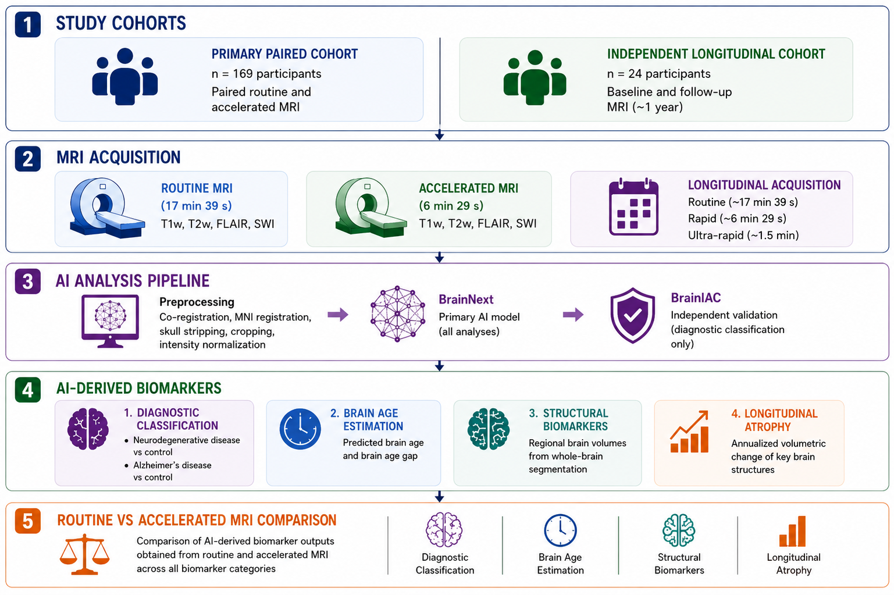

# B-RAPIDD

**Accelerated MRI Preserves AI-Derived Neuroimaging Biomarkers for Dementia Diagnosis and Monitoring**

This repository contains code supporting the analyses performed in the B-RAPIDD study, which evaluates whether accelerated brain MRI preserves the information required for AI-derived neuroimaging biomarkers across diagnostic, quantitative, and longitudinal applications.

The study evaluates paired routine and accelerated MRI acquisitions across four clinically relevant downstream tasks.

<p align="center">
  
</p>

<p align="center">
  <b>Figure 1.</b> Overview of the B-RAPIDD study framework, including paired routine and accelerated MRI acquisitions and evaluation across anatomical segmentation, diagnostic classification, chronological brain age estimation, and longitudinal atrophy analysis.
</p>

## Tasks

### 1. 32 Brain Anatomical Segmentation Task

Whole-brain anatomical segmentation was evaluated across **32 brain structures** to assess whether accelerated MRI preserves regional anatomical information required for quantitative neuroimaging analysis.

Code related to this task is provided in:

```text
01_anatomical_segmentation/
